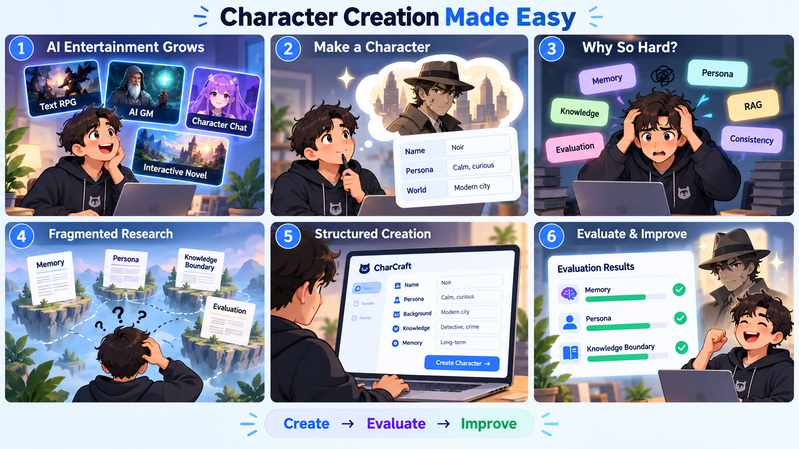
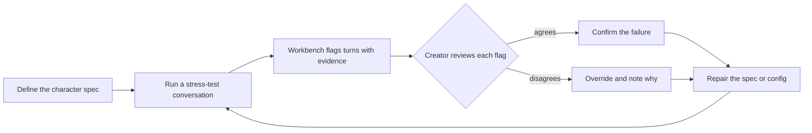

# Design specification

<!-- cp2-templates-v2 -->

Journeys, flows, screens, and collaboration mechanics for the workbench. CP2 Step 8.

**Status:** EMPTY.

> Sections 1 to 5 can start now from the class storyboard. Sections 6 and 7 wait for the evidence in validation/GAP_ANALYSIS.md, THEORY_LENS.md, and OPPORTUNITY_FRAMING.md.
> Every major UI choice must trace back to the theory lens or the opportunity framing (section 7.5). The CP2 guide calls this "no orphan features."
> Give each section one owner, so two people never edit the same section at once.

| Section | Owner | Status |
| --- | --- | --- |
| 1. Personas and mental models | [ ] | [ ] |
| 2. Journeys and task flows | [ ] | [ ] |
| 3. Wireframes and key screens | [ ] | [ ] |
| 4. Interaction details | [ ] | [ ] |
| 5. Design system alignment | [ ] | [ ] |
| 6. What changed because of the evidence | [ ] | [ ] |
| 7. Collaboration mechanics | [ ] | [ ] |

---

## 1. Personas and mental models

> How does the creator think about working with the AI? What do they expect it to do on its own, and where do they expect control?
> The guide wants decision rights, interrogation moments, and trust cues tied to the persona. The details live in section 7, so summarize them here in one line each.

**Primary persona:** [ ]

**Mental model:** [ ]

**Decision rights, interrogation, and trust cues:** [ one line each; details in section 7 ]

---

## 2. Journeys and task flows

> The class storyboard is the starting point for Journey 1.
> GitHub draws Mermaid diagrams inside markdown, so the starter diagram below shows up as a real flowchart on the repo page with no drawing tool. It uses the Define, Stress-test, Diagnose and Repair loop from CP1. Edit the boxes to match what the team decides.

### Journey 1: [ name ]

1. [ ]
2. [ ]
3. [ ]

**Entry point:** [ ]

**Success state:** [ ]

**Failure or recovery path:** [ ]

---

## 3. Wireframes and key screens

> Save images in docs/wireframes/ as SCREEN_vN.png, for example flag_review_v1.png, and link each one in the table.

| Screen | Purpose | Key interactions | Image |
| --- | --- | --- | --- |
| [ ] | [ ] | [ ] | [ ] |
| [ ] | [ ] | [ ] | [ ] |

---

## 4. Interaction details

- **Input controls:** [ ]
- **Streaming or progressive output:** [ ]
- **Feedback loops:** [ how the creator knows what the system is doing ]
- **Error and empty states:** [ ]

---

## 5. Design system alignment

> The rubric grades this. Pick one system and say how we applied it.

**System chosen:** [ Google Material 3 / Google Stitch / IBM Carbon / Apple HIG ]

**Why:** [ ]

**How we applied it:** [ color roles, type scale, spacing, component choices ]

---

## 6. What changed because of the evidence

> Ties the design back to the prompting study and the interviews. Every row cites a receipt.

| Design decision | Evidence that drove it (receipt) |
| --- | --- |
| [ ] | [ ] |

---

<!-- theory-patch-v1 -->
## 7. Collaboration mechanics

> Grounded in validation/THEORY_LENS.md. The rubric grades this section.
> Our draft claim says the workbench shows evidence with each flag so the creator questions it. Sections 7.2 and 7.3 are where that becomes concrete.

### 7.1 Decision rights

| Decision | Who decides | Can the other side override? |
| --- | --- | --- |
| Is this turn a consistency failure? | [ ] | [ ] |
| Which failure type is it? | [ ] | [ ] |
| Does the character spec change because of it? | [ ] | [ ] |

### 7.2 Interrogation moments

> Points where the creator is pushed to question a flag instead of accepting it.

| Moment | What the creator sees | What the creator has to do |
| --- | --- | --- |
| [ ] | [ ] | [ ] |

### 7.3 Trust-calibration cues

> What the interface shows so trust matches reliability: uncertainty, provenance, and what the AI could not check.

| Cue | Where it appears | What it should change in the creator's behavior |
| --- | --- | --- |
| [ ] | [ ] | [ ] |

### 7.4 Disagreement and escalation

[ what happens when the creator and the AI disagree, and when the AI hands a turn to the human ]

### 7.5 No orphan features

> Section 6 covers the evidence. This table covers the theory and the requirement.

| Screen or interaction | Traces back to (THEORY_LENS Part 3 row or OPPORTUNITY_FRAMING feature) |
| --- | --- |
| [ ] | [ ] |
