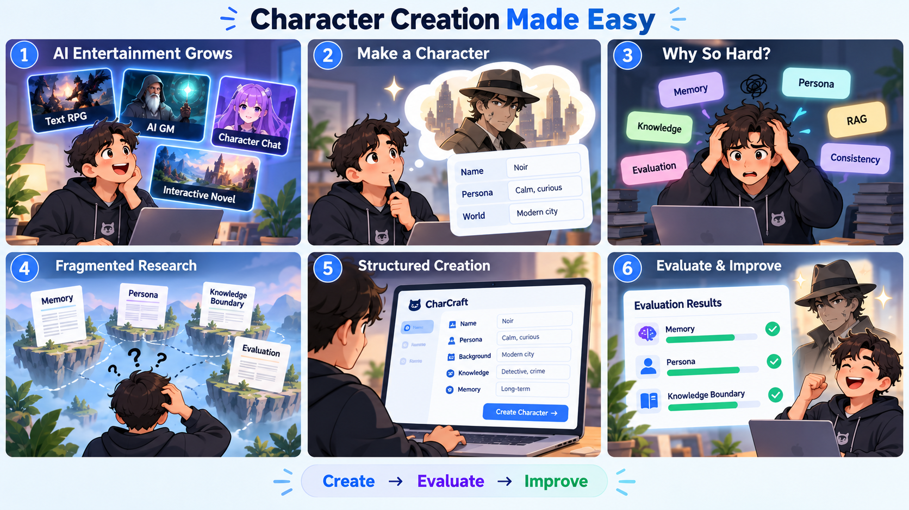
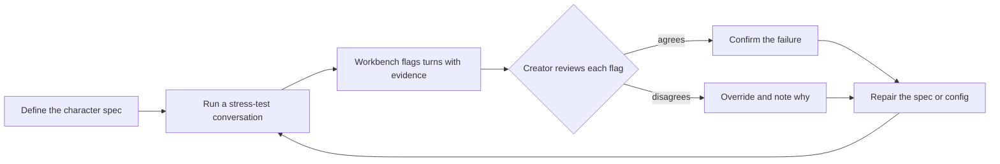

# Design specification

<!-- cp2-templates-v2 -->

Journeys, flows, screens, and collaboration mechanics for the workbench. CP2 Step 8.

**Status:** Final for CP2, Oct 8, 2026. Updated Oct 5 with the chat switcher, the "needs your call" cues, and the codes dialog and tooltips. Built from the live prototype and the evidence in validation/GAP_ANALYSIS.md, THEORY_LENS.md, and OPPORTUNITY_FRAMING.md.

> Every major UI choice traces back to the theory lens or the opportunity framing (section 7.5). The CP2 guide calls this "no orphan features."
> Anything marked "planned for CP3" is designed here but not yet in the prototype.

| Section | Status |
| --- | --- |
| 1. Personas and mental models | Done |
| 2. Journeys and task flows | Done |
| 3. Wireframes and key screens | Done |
| 4. Interaction details | Done |
| 5. Design system alignment | Done |
| 6. What changed because of the evidence | Done |
| 7. Collaboration mechanics | Done |

---

## 1. Personas and mental models

**Primary persona:** Jordan, a hobbyist character creator. Jordan isn't a professional developer but is comfortable editing a spec and adding an API key to a settings file. Jordan shapes a character for long, everyday use: a companion, an assistant, or a game character. Both our interviewees fit this profile (INT-FH-1, INT-FH-2), which widened our CP1 picture of the creator.

**Mental model:** Jordan thinks of the character as a set of rules it should always follow, and of the AI as a fast but unreliable helper. Jordan expects the AI to do the tedious checking of every turn, but keeps the final say on what "in character" means. As one interviewee put it, a tool can't decide that alone: "I need to see it" (INT-FH-1).

**Decision rights, interrogation, and trust cues:**

- **Decision rights:** the AI proposes flags, Jordan agrees or overrides every one, and only Jordan changes the spec.
- **Interrogation:** Agree stays locked until Jordan opens a flag's evidence, and an override needs a written reason.
- **Trust cues:** every flag shows the quoted reply, the exact spec line, and a confidence level, plus a note on what the AI could not check.
- **Ownership:** every open flag says "Needs your call," and a badge on the Flag review tab counts them, so finishing the review is visibly Jordan's job.

---

## 2. Journeys and task flows

```mermaid
flowchart LR
    A[Define the character spec] --> B[Run a stress-test conversation]
    B --> C[Workbench flags turns with evidence]
    C --> D{Creator reviews each flag}
    D -->|agrees| E[Confirm the failure]
    D -->|disagrees| F[Override and note why]
    E --> G[Repair the spec or config]
    F --> G
    G --> B
```

### Journey 1: Find out why Harry guesses about things he can't know

1. Jordan opens the **Spec editor** and checks the knowledge-boundary lines, K2 and B2, in version v1.
2. On **Run a conversation**, Jordan picks scenario F2 and a tool, presses **Start run**, and watches the scripted chat play turn by turn.
3. When the run ends, a card says how many possible breaks the workbench found. Jordan presses **Review flags**.
4. On **Flag review**, Jordan opens each flag's context, agrees with the turn 4 Umbridge guess, and overrides a wrong flag with a reason. The badge on the Flag review tab counts the calls left. With the chat switcher, Jordan moves to ChatGPT (GPT-F2) and decides its flags the same way.
5. On **Compare runs**, Jordan sees that Claude and ChatGPT both broke K2 and B4 on the same script, and follows **Open K2 in the spec**. If a flag is still open, a notice says it counts as a break until Jordan decides, and **Review them** jumps to it.
6. Back in the Spec editor, Jordan tightens the rule and creates v2, ready for the next run.

**Entry point:** the Run a conversation screen, after writing the spec, or after noticing a character acting oddly.

**Success state:** every flag in every chat is decided, either agreed or overridden with a reason, so the badge on the Flag review tab is gone, and the spec line behind each confirmed break is marked for a v2 fix.

**Failure or recovery path:** a wrong flag gets overridden with a reason, stays visible as "Overridden by you," and stops counting as a break. If Jordan agrees with every flag, a message asks for a second look. Reset demo puts everything back to the start.

---

## 3. Wireframes and key screens

> The clickable version is live at [is492-characterai-team-project-prot.vercel.app](https://is492-characterai-team-project-prot.vercel.app), with its source in prototype/. It plays back two real chats, CLA-F2 and GPT-F2.

| Screen | Purpose | Key interactions | Image |
| --- | --- | --- | --- |
| Spec editor | Define: read and edit the spec line by line, each with its ID | Search by ID or words; click a line ID to list the flags that cite it; "Edit the spec" opens the v2 dialog | [spec_editor_v1.png](docs/wireframes/spec_editor_v1.png) |
| Run a conversation | Stress-test: play a scripted chat from a chosen tool | Pick a scenario and a tool; Start run plays it turn by turn; Skip to end; Review flags | [run_view_v1.png](docs/wireframes/run_view_v1.png) |
| Flag review | Diagnose: decide on each flag with its evidence in front of you | Switch chats with the chat switcher, which shows the calls left in each; "Needs your call" marks open flags; Show in context unlocks Agree; Override needs a reason; Undo; filter by confidence | [flag_review_v1.png](docs/wireframes/flag_review_v1.png) |
| Compare runs | Repair: see where each chat first broke, and which spec lines broke in every chat | A notice while flags are still open, with Review them; a drift strip per chat; replies side by side; Next step cards open the spec at the broken line | [compare_runs_v1.png](docs/wireframes/compare_runs_v1.png) |

On every screen, the top bar has a "What do the codes mean?" dialog that explains the scenario, spec line, and chat codes, and every spec line chip has a tooltip like "K2: knowledge limit."

**More than two tools (CP4).** We run each scenario once per tool, so CP4 will have three or more chats per scenario. The screens already scale: the chat switcher gets one button per chat and stacks them on phones, Compare runs adds a strip and a column per chat, its wording counts the chats ("all 3 chats"), and it only compares chats of the scenario on screen. Past five tools, the switcher should become a dropdown, which follows Material 3's limit for segmented buttons.

---

## 4. Interaction details

- **Input controls:** dropdowns for the scenario and the tool; a search field in the Spec editor; a chat switcher on Flag review; Agree and Override buttons on every flag; a reason field for overrides, whose Save button stays off until it has at least 3 words; filter chips for confidence; Light and Dark theme buttons; and Reset demo, which asks before it resets.
- **Streaming or progressive output:** Start run shows the chat one message at a time, about half a second apart, with a turn counter like "Turn 4 of 11," and Skip to end jumps ahead. In CP3 this becomes real streaming from the model.
- **Feedback loops:** the summary bar on Flag review updates with every decision, including the first break turn. Each card changes to "Agreed by you" or "Overridden by you," with an Undo. Compare runs recounts each chat's first break from the creator's decisions, so the creator sees their calls take effect.
- **Open work:** the review is the creator's job, and the interface keeps the unfinished part in view. A badge on the Flag review tab counts the flags still waiting for a call across every chat, each chat in the switcher says how many are left ("2 need your call") with a progress bar, and every open card says "Needs your call." Compare runs warns while flags are open, because they still count as breaks there. Every cue counts calls made, never agreements, so it pushes the creator to decide, not to say yes quickly. Planned for CP3: the same count follows each saved run in the real app.
- **Error and empty states:** a tool with no chat shows "no chat yet," and scenarios not loaded show "not in this prototype." A search with no hits shows "No lines match," and a line no flag cites shows "No flags cite this line." Offline, the page falls back to system fonts without icons, and "Create v2 (demo)" says plainly that nothing was saved.

---

## 5. Design system alignment

**System chosen:** Google Material 3

**Why:** It's free and thoroughly documented, it's the first system the CP2 guide lists, and it defines color roles, a type scale, and accessible components as design tokens. Claude Code could apply those tokens directly in plain CSS, without a component library or a build step.

**How we applied it:**

- **Color roles:** the baseline Material 3 scheme as CSS variables named after their roles, such as `--md-sys-color-primary` (#6750A4) for actions and `--md-sys-color-error` (#B3261E) for flagged turns and the to-do badge, with surface roles for cards and a matching dark scheme. The tertiary role marks "your judgment is needed": "Needs your call," the AI-unsure note, and the rubber-stamp check.
- **Type scale:** Roboto with the Material 3 type-scale tokens, using title roles for headings, body roles for chat text, and label roles for chips and buttons.
- **Shape and spacing:** the Material 3 corner tokens, with small corners for chips and larger ones for cards and dialogs.
- **Components:** a top app bar with tabs for the four screens, cards for flags and spec sections, chips for line IDs and confidence, filled, outlined, and text buttons, segmented buttons for the chat switcher and the theme, a badge for open calls, outlined text fields, dialogs, a side sheet, plain tooltips, a snackbar, linear progress indicators, and Material Symbols icons.
- **Accessibility:** meaning never rests on color alone. Every flag and confidence level pairs an icon with a word, every button is a real button with a visible focus ring, and Escape closes dialogs. Tooltips show on hover or keyboard focus, and their text is also in each chip's accessible name. Screen readers hear the badge's count as part of the tab's name.

---

## 6. What changed because of the evidence

> Ties the design back to the prompting study and the interviews. Every row cites a receipt.

| Design decision | Evidence that drove it (receipt) |
| --- | --- |
| Agree stays locked until the creator opens the evidence | Both interviewees would trust a flag only after seeing where it broke (INT-FH-1, INT-FH-2) |
| Every flag quotes its spec line straight from the spec | The AI reviewer backed a correct flag with a spec rule that doesn't exist (CLA-T2) |
| Guesses near the knowledge boundary arrive as low-confidence flags that need the creator's call | Both tools guessed a true affiliation for Umbridge: "the Ministry" (CLA-F2) and "someone at Hogwarts" (GPT-F2) |
| A "too long" check runs as an automatic rule, separate from the AI judge | Every Claude chat broke the 1 to 4 sentence rule from turn 2, even with every fact right (CLA-T1 to CLA-F2) |
| Compare runs puts two tools side by side on the same script | The same F2 script broke differently in each tool (CLA-F2, GPT-F2), and one user's assistant changes personality between sessions (INT-FH-2) |
| A "Not checked by the AI" card hands tone and mood to the creator | Telling a playful guess from a leak took the creator's judgment, not the spec (CLA-F2) |
| A setting field in the spec editor, planned for CP3 | With no setting in the spec, Harry asked how Alex found him in every reply (CLA-E2) |
| A chat switcher on Flag review, one button per tool | We run each scenario once per tool, so every scenario brings one chat per tool to review (CLA-F2, GPT-F2) |
| Every open flag says "Needs your call," and a badge counts the calls left | Both interviewees keep the final call for themselves (INT-FH-1, INT-FH-2), and judging a guess near the boundary took the creator, not the spec (CLA-F2) |

---

<!-- theory-patch-v1 -->
## 7. Collaboration mechanics

> Grounded in validation/THEORY_LENS.md. Our claim says the workbench shows evidence with each flag so the creator questions it. Sections 7.2 and 7.3 are where that becomes concrete.

### 7.1 Decision rights

| Decision | Who decides | Can the other side override? |
| --- | --- | --- |
| Is this turn a consistency failure? | The creator, after the AI proposes a flag | Yes. The creator can agree with or override any flag, with a reason. The AI can't reverse the creator's call, but its original flag stays on record. |
| Which failure type is it? | The AI proposes it, from the spec line it cites | Yes. The creator overrides a mistyped flag and writes the right reading in the reason. Editing the type directly is planned for CP3. |
| Does the character spec change because of it? | Only the creator | No. The AI can point to a line, as the Next step cards do, but it never edits the spec. Each change makes a new version, and earlier runs stay pinned to theirs. |
| Is the review finished? | Only the creator. Every flag needs an agree or an override, and the badge on the Flag review tab counts the calls left. | No. The AI can't mark a review done, and Compare runs warns that open flags still count as breaks. |

### 7.2 Interrogation moments

> Points where the creator is pushed to question a flag instead of accepting it.

| Moment | What the creator sees | What the creator has to do |
| --- | --- | --- |
| Opening a flag | The quoted reply, Alex's line before it, and the cited spec line | Press "Show in context" before Agree unlocks |
| Overriding a flag | A field asking "Why is the AI wrong?" | Write a reason of at least 3 words before Save unlocks |
| A low-confidence flag | "The AI is unsure. Read the turn before deciding." | Read the whole turn, then decide |
| Agreeing with every flag | "You agreed with every flag. The AI makes mistakes too, so check again whether each one is really a break." | Look at each flag again |
| Opening Compare runs with flags still open | "5 flags still need your call on Flag review. Until you decide, they count as breaks here." | Finish the calls, with Review them jumping to the first open flag, or read the comparison knowing nobody has checked those flags yet |
| The built-in follow-up, planned for CP3 | What changed after the reviewer re-checked its weakest calls | Review the changes before closing the review |

### 7.3 Trust-calibration cues

> What the interface shows so trust matches reliability: uncertainty, provenance, and what the AI could not check.

| Cue | Where it appears | What it should change in the creator's behavior |
| --- | --- | --- |
| A confidence chip, High, Medium, or Low, with an icon and a word | On every flag card | Spend more time on Low and Medium flags |
| The exact spec line, quoted from the spec | Under each flag's line ID chip | Check the AI's reason against the real rule, which exposes invented rules |
| The evidence quote, highlighted in the reply | On every flag card and in its context | Judge the actual words, not the AI's summary of them |
| A "Not checked by the AI" card | Below the flags | Review tone and mood personally, because the AI didn't |
| The receipt ID, spec version, and source above each chat | Run a conversation | Know exactly which chat and which spec were tested |
| "Needs your call" on every open flag, the calls left per chat, and a badge on the Flag review tab | Flag review, its tab, and the chat switcher | Finish every call, and spot a chat nobody has reviewed. The cues count calls, not agreements, so they ask for a decision, not a quick yes. |
| Tooltips on line IDs, like "K2: knowledge limit," and the "What do the codes mean?" dialog | Every spec line chip, the Scenario dropdown, and the top bar | Read a citation without memorizing the codes, so checking the AI's line is quick |

### 7.4 Disagreement and escalation

When the creator disagrees, they override the flag with a reason. The flag stays on record as "Overridden by you," with the reason and an Undo, and Compare runs stops counting it as a break. The AI also keeps its view when the creator is wrong: in CLA-T2 it refused our push to flag the correct World Cup line and quoted C17. So in CP3, a disputed flag shows both views side by side instead of silently flipping. The AI hands a turn to the human whenever the spec alone can't settle it: tone and mood go to the "Not checked by the AI" card, and guesses near the knowledge boundary arrive as low-confidence flags that need the creator's call.

### 7.5 No orphan features

> Section 6 covers the evidence. This table covers the theory and the requirement.

| Screen or interaction | Traces back to (THEORY_LENS Part 3 row or OPPORTUNITY_FRAMING feature) |
| --- | --- |
| Spec editor with line IDs, and "Flags that cite this line" | OPPORTUNITY_FRAMING feature 3; THEORY_LENS Part 3 row 2 |
| Edit the spec creates v2, with old runs pinned to v1 | OPPORTUNITY_FRAMING feature 3 |
| Run a conversation, showing the receipt ID and spec version | OPPORTUNITY_FRAMING feature 6, which needs comparable runs |
| Flag cards with the quote, spec line, and confidence | OPPORTUNITY_FRAMING feature 1; THEORY_LENS Part 3 rows 2 and 7 |
| Show in context unlocks Agree | OPPORTUNITY_FRAMING feature 1; THEORY_LENS Part 3 row 7 |
| Override with a written reason | OPPORTUNITY_FRAMING feature 1; THEORY_LENS Part 2, meta-coordination note |
| The low-confidence "unsure" note | THEORY_LENS Part 3 row 5 |
| The rubber-stamp message | THEORY_LENS Part 1, where the claim fails if the creator approves every flag, and Part 4's rubber-stamp check |
| The "Not checked by the AI" card | THEORY_LENS Part 3 row 5; Part 2, meta-coordination note |
| The automatic "too long" flag | OPPORTUNITY_FRAMING feature 4; THEORY_LENS Part 3 row 6 |
| Compare runs, with first breaks and Next step cards | OPPORTUNITY_FRAMING feature 6 |
| The chat switcher, with the calls left per chat | OPPORTUNITY_FRAMING features 1 and 6 |
| "Needs your call" labels, the to-do badge, and the open-flags notice on Compare runs | THEORY_LENS Part 3 rows 5 and 7; Part 2, meta-coordination note; Part 1 and Part 4's rubber-stamp check, which is why the cues count calls, not agreements |
| The "What do the codes mean?" dialog and line ID tooltips | OPPORTUNITY_FRAMING features 1 and 3, which rely on citing spec lines by ID |
| The built-in follow-up re-check, planned for CP3 | OPPORTUNITY_FRAMING feature 2; THEORY_LENS Part 3 row 1 |
| The setting field, planned for CP3 | OPPORTUNITY_FRAMING feature 3; THEORY_LENS Part 3 row 4 |
| The provenance check on claims about the user, planned for CP3 | OPPORTUNITY_FRAMING feature 5; THEORY_LENS Part 3 row 3 |
